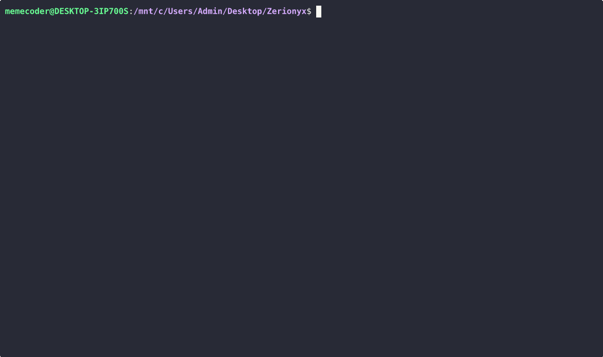

<p align="center">
  
  <h1 align="center">Zerionyx Programming Language</h1>
  <p align="center">
    
    
    
    
    
    <a href="LICENSE"></a>
  </p>
</p>

---

## Table of Contents

- [Overview](#overview)
- [Why Zerionyx?](#why-zerionyx)
- [Interactive Shell Demo](#interactive-shell-demo)
- [Features](#features)
- [Code Samples](#code-samples)
- [Getting Started](#getting-started)
- [Recommended Setup](#recommended-setup)
- [Roadmap](#roadmap)
- [Contributing](#contributing)
- [Looking for Contributors](#looking-for-contributors)
- [Acknowledgments](#acknowledgments)
- [License](#license)
- [Contact](#contact)

---

## Overview

**Zerionyx** is an educational programming language built in Python, designed for **learning** and **lightweight task automation**.  
Designed to be minimal yet powerful &mdash; **Zerionyx bridges the gap between learning and real-world scripting.**

It offers:

* Beginner-friendly syntax  
* Immediate visual feedback and clear error diagnostics  
* Built-in libraries (math, algorithms, data structures)  
* File handling and scripting support  
* Lightweight yet expressive &mdash; ideal for teaching and prototyping

---

## Why Zerionyx?

* **Great for learners** who want to understand programming fundamentals  
* **Perfect for educators** to create interactive demos and tools  
* **Optimized for simplicity over performance** &mdash; not intended for large-scale production systems

---

## Interactive Shell Demo

<p align="center">
  
</p>

---

## Features

* Intuitive and consistent syntax  
* Educational standard libraries (e.g., math, algorithms)  
* Visual error diagnostics to help learners  
* File I/O and automation commands  
* Interactive shell with REPL support

---

## Code Samples

```
# Hello World
println("Hello, World!")
print("Hello, World!\n")

# Arithmetic
x = 10
y = 20
println(x + y)
println(x - y)
println(x * y)
println(x / y)
println(x % y)
println(x // y)
println(x ^ y)

# Alias
a = 10
a as b
# println(a) <-- Error!
println(b)

# Function definition
defun add(a, b)
    return a + b
done

# One-line function
defun add(a, b) -> a += b

println(add(5, 3))

# Lists
nums = [1, 2, 3, 4, 5]
append(nums, 6)
println(nums)
println(nums$0)
println(nums$5)

# HashMaps
users = []
append(users, {})
users$0$"name" = "user-1"
users$0$"password" = "123456"
println(users)
println(users$0$"name")
println(users$0$"password")

# Bytes
str_enc = to_bytes("Hello, World!")
println(to_str(str_enc))
println(str_enc$0)
println(str_enc$4)

# PyObject
os = pyexec("import os", {})
println(type(os))
r = pyexec("os.system('echo Hello, World!')", os)

# CFloat
to_cfloat as tcf
lst = [tcf("1/9")] * 9
x = tcf(0)
for i in lst do
    x += i
done
println(x == 1)

# Conditional
if x > y do
    println("X is greater")
elif x < y do
    println("Y is greater")
else do
    println("X is equals to Y")
done

# For-in loop
for i in nums do
    println(i)
done

# For loop
for i = 1 to 11 do
    println(i)
done

# While loop
a = 1
while a > 100 do
    a += 1
done
println(a)

# NameSpace
namespace m
    pi = 3.14
    defun area(r) -> pi * r * r
done
println(m.area(5))
```

For more examples, check the [`tests`](tests) folder for a full overview.

---
## Getting Started

### 1. Clone this repo

```bash
git clone https://github.com/memecoder12345678/Zerionyx.git
cd Zerionyx
```

### 2. Install required packages

```bash
python -m pip install -r requirements.txt
```

### 3. Run a Zerionyx script

```bash
python zerionyx.py tests/test.zyx
```

### 4. Launch interactive shell

```bash
python zerionyx.py
```

Use commands such as `grammar`, `license`, etc., for more details.

### 5. Full Documentation

👉 [Zerionyx Docs](https://memecoder12345678.github.io/Zerionyx/docs.html)

---

## Recommended Setup

* **Python 3.11+** for best compatibility
* **PyPy 3.11** for faster performance (optional)

---

## Roadmap

* [x] Add basic REPL and shell commands
* [x] Add algorithms & data structure libraries
* [X] Integrate debugger support
* [X] Improving interpreter performance 
* [X] Creating **VS Code plugin** (syntax highlighting only)
---

## Contributing

Contributions are welcome! To get involved:

1. Fork the repo
2. Branch: `git checkout -b feature/my-feature`
3. Commit your changes: `git commit -m "Describe feature"`
4. Push & open a Pull Request 🎉

---

## Looking for Contributors

Zerionyx is growing fast &mdash; we're looking for awesome people to help shape its future.

We're especially looking for contributors interested in: 
  
- Writing test suites and improving interpreter performance  
- Creating developer tools (debuggers, profilers, code formatters)  

**Requirements?**  

> No strict rules &mdash; if you're passionate about compilers, VMs, or language design, join in!

### How to join:

1. Fork the repo & check open issues  
2. Pick a task or open a proposal  
3. Join the project by opening a Pull Request  
4. Or reach out via [GitHub issues](https://github.com/memecoder12345678/Zerionyx/issues)

Let’s make Zerionyx better, together 💚

---

## Acknowledgments

Thanks to the open-source makers and template authors for README inspiration ([github.com][2], [en.wikipedia.org][1], [makeareadme.com][3]).

---

## License

Zerionyx is released under the **MIT License**. See [LICENSE](LICENSE).

---

## Contact

* GitHub: [memecoder12345678](https://github.com/memecoder12345678)
* Official website: [memecoder12345678.github.io/Zerionyx](https://memecoder12345678.github.io/Zerionyx)
* Docs: [memecoder12345678.github.io/Zerionyx/docs.html](https://memecoder12345678.github.io/Zerionyx/docs.html)

[1]: https://en.wikipedia.org/wiki/README "README"
[2]: https://github.com/jehna/readme-best-practices "Best practices for writing a README for your open source project - GitHub"
[3]: https://www.makeareadme.com/ "Make a README"

